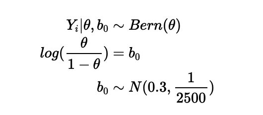
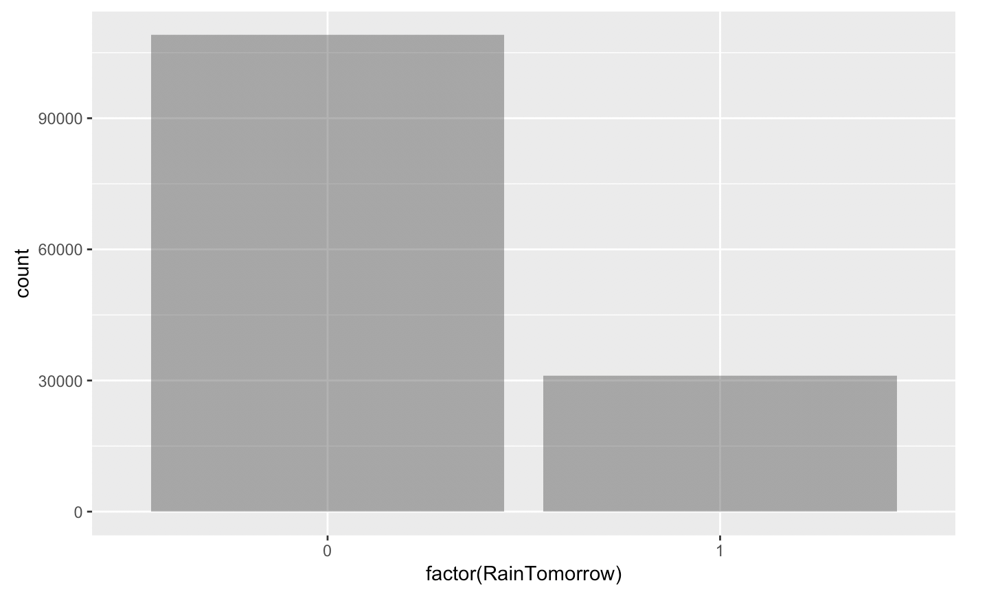
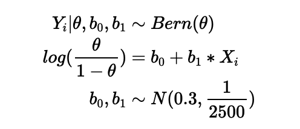
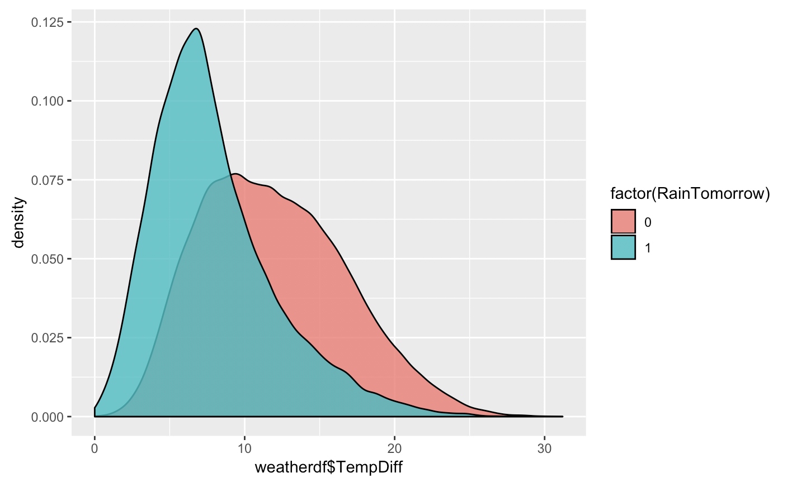
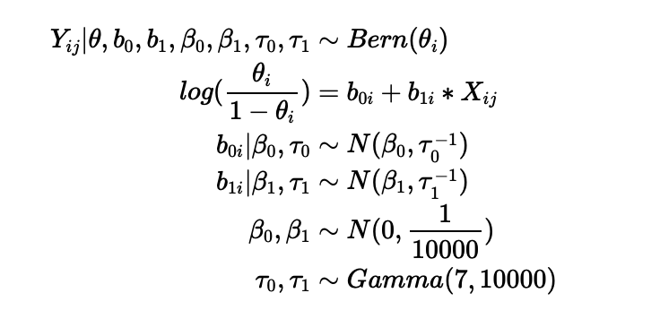
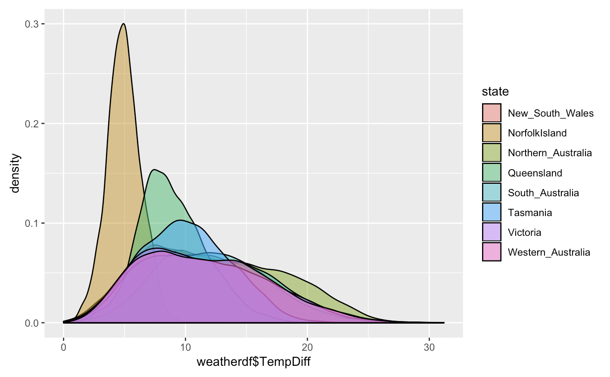
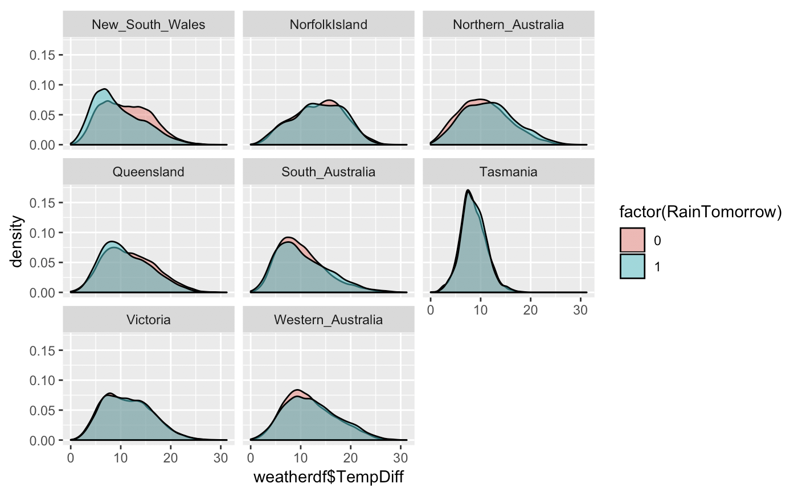
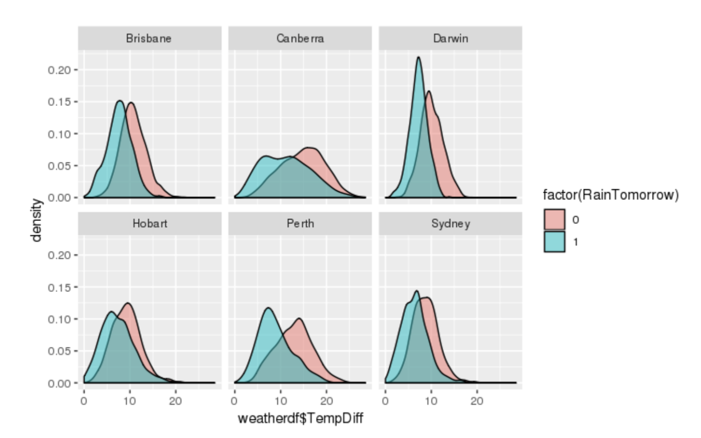
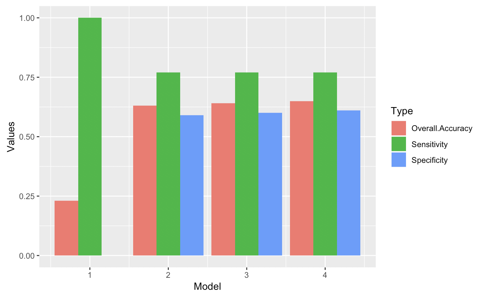

# Aussie Weather Forecast: Is it going to rain tomorrow?

*Using Bayesian models predicting whether it will rain tomorrow in Australia*

## Motivation
The development of human civilization has been highly depending on weather and climate. As early as the primitive society, precipitation played an irreplaceable role in agriculture and migration: it not only helped our ancestors to find out the best timing for sowing, but also determined where the next destination of the nomadic civilizations would be. Rainfall, as one of the major sources of freshwater, largely decided the survival rate of our ancestors. Today, people still care very much about weather and climate even though sowing seeds and nomadic life are away from our daily life. Numerous psychological studies have shown that pleasant weather is associated with better mood and memory. Other researchers suggest that sunny weather even boosts stock market returns. Moreover, for practical reasons, people need to know how to dress for the weather and whether they should bring an umbrella to work. As a result, correctly predicting the rainfalls is crucial in planning our schedule and improving life quality. Our research aims to create a prediction model for precipitation. When given sufficient information, our model is expected to output an accurate prediction on whether Australia is going to rain on the next day.

## Dataset
Our project aims to investigate and predict whether it will rain tomorrow by training a binary classification model. The original data are from the Bureau of Meteorology of Australia. The dataset was gathered by Joe Young in 2017. There are 142 thousand rows in the dataset, recording the weather observations in a ten-year period from October 2007 to January 2017. It contains daily weather observations from numerous Australian weather stations and the RainTomorrow binary indicator as a target. Below is a list of variables that we will use in our analysis: 

| Variable      | Description                                                                  | 
| ------------- |:----------------------------------------------------------------------------:|
| Rain Tomorrow | The target variable: Did it rain the next day of the observation?  Yes or No | 
| TempDiff      | The numerical difference between MaxTemp and MinTemp in Celsius              | 
| State         | The state where a town/city is located in Australia                          |
| City          | The city in Australia                                                        | 

## Models and Methodology

This paper mainly relies on Bayesian Statistics and the Logistic Classification method. To predict the probability of raining tomorrow, we build three primary models, along with the fourth model which is an improved version of Model 3. 

**Model 1: RainTomorrow~1**
*Assumption: Whether it rains tomorrow only depends on the overall raining rate.*

We started with the simplest model, which counts the number of days that rain tomorrow in model 1. This diagram gives the general sense that most of the days in our dataset don’t rain on the next day. The number of days that rain tomorrow is around 30000 and the number of days that don’t rain tomorrow is around 110000. There are approximately 3.5 times days that don't rain tomorrow than the number of days that rain tomorrow.

**Model 2: RainTmr~TemDiff**
*Assumption: Whether it rains tomorrow only depends on the today's temperature difference.*

Then we incorporate the first covariate, the temperature difference, into model 2. This plot illustrates that if the temperature difference is below 8 degrees Celsius, it’s very likely to rain tomorrow. If the temperature difference is above 8 degrees Celsius, the probability of raining tomorrow would be low and it’s unlikely to rain. Since the area under both curves don’t have a lot of overlaps, our observations and conclusions above are relatively clear and convincing. 

**Model 3: RainTmr~ State+ TemDiff **
*Assumption: Whether it rains tomorrow depends on the today's temperature difference and the state.*

Then, we extend model 2 by adding the state variable into model 3. This plot gives an overview of the distribution of daily temperature differences in each state in Australia. We group all the cities into 8 states: New South Wales, Norfolk Island, Northern Australia, Queensland, South Australia,Tasmania, Victoria, Western Australia. From the plot, we observe that most of the states have similar distributions, where their temperature differences center around 10 degrees Celsius, with a relatively large spread/variance. Norfolk Island, Queensland, and Tasmania have rather different patterns. Norfolk Island’s mean temperature difference is 5 degrees Celsius and has relatively stable temperature during a day. Queensland’s mean temperature difference is 8 degrees Celsius with relatively small spread/variance. Tasmania’s mean temperature difference is 10 degrees Celsius with relatively small spread/variance, compare with the other common states. 

Lastly, we graph the distribution of raining tomorrow and that of not raining tomorrow for each state/region, with respect to the temperature difference. The most obvious observations that we have is that, if New South Wales, Northern, Western, Southern Australia, Vistoria, or Tasmania has a temperature difference above 10 degrees Celsius, it's unlikely to rain tomorrow in that state;  if the  temperature difference is below 10 degrees Celsius, it's likely to rain tomorrow in that state. Queensland’s plot suggests a similar threshold at 8 degree Celsius. Norfolk Island is the most vague one, because the pink and blue area under the curves highly overlap with each other, making it hard to distinguish the threshold. Part of the reason is that the temperature difference on Norfolk Island is very small.  

**Model 4: RainTmr~ City + TemDiff **
*Assumption: Whether it rains tomorrow depends on the today's temperature difference and the city.*

This model is an improved version of Model 3 and replaces the state variable with the city variable, so that we can predict the weather for each city more precisely and make the model more practical for people to use in daily life. The above 6 plots present the distributions of raining tomorrow(blue) and not raining tomorrow(pink) for the top six cities with most data and presumably the most popular ones in Australia, with respect to today's temperature differences. The threshold for Brisbane, Darwin, Hobart, and Sydney is around 8 degrees Celsius, meaning that if today's temperature difference is below 8 degrees Celsius, tomorrow is likely to rain; Vice versa. The threshold of Perth is around 10 degrees Celsius, and that for Canberra is 12 degrees Celsius. Their thresholds are different, because these cities are located in different geographical areas. 

## Result
**Model 1:** RainTomorrow~1, whether it rains tomorrow depends on the overall raining rate

The probability of raining tomorrow centers around eˆ(-1.2784)/[eˆ(-1.2784)+1] = 0.22, given the mean of b0, log odds of raining rate, is -1.27, with a very small standard deviation of 0.0207. Its trace plot is relatively stable, indicating the certainty of this model. 

**Model 2:** RainTomorrow~ TempDiff, whether it will rain tomorrow depends on the overall raining rate, which changes according to the temperature difference.

In this model, we have two priors: the intercept of the trend between global raining rate and each temperature difference, the slope of the trend between global raining rate and each temperature difference. The intercept centers around 0.7969 and the slope centers around -0.2151. 

**Model 3:** RainTomorrow~ State + TempDiff, whether it rains tomorrow depends on the raining rate in a specific state, each of which has a different trend with temperature difference. The individual states intercept and slope are normally distributed around global intercept and slope. 

This model shows that the log odds of the probability of raining tomorrow is centered around 1.18 and would decreases by 0.274 for every one unit of increases in temperature difference. To study the probability of raining tomorrow for each state, we then account for the global slope and global intercept, along with the individuality of each state by state-level intercept and state-level slope. Its trace plot is stable and density plot is normally distributed. 

**Model 4:** RainTomorrow~ City + TempDiff, whether it rains tomorrow depends on the raining rate in a specific city, each of which has a different trend with temperature difference in Celsius. The individual city intercept and slope are normally distributed around global intercept and slope.
	Model 4 is similar to Model 3, but it uses city instead of state. We hope to see a more accurate result by substituting the state location predictor with a more specific and narrowed-down city predictor. Model 4’s trace plot is relatively stable, indicating the model is appropriate.

## Model Evaluation

To evaluate the models, we will compare the models and pick the most suitable and practical one based on their complexities and accuracies. Model 1 is the simplest, Model 2 is more complex, Model 3 is the most complex, and Model 4 is equally complex as Model 3. Thus, Model 1 wins in terms of model complexity. To compare their accuracies, we construct the confusion matrix for each of the models and calculate the sensitivity, specificity, and overall accuracy for each model. Sensitivity gives the probability of correctly recognizing rainy days as rainy, specificity gives the probability of correctly recognizing not rainy days as not rainy, and overall accuracy illustrates the probability for the model to make correct predictions. By setting the threshold of the probability at 0.2, meaning that it will rain tomorrow if the probability of raining tomorrow is larger than 0.2, we get the confusion matrix for each model. 

|                 | Model 1  | Model 2  | Model 3  | Model 4  | 
| --------------- |:--------:|:--------:|:--------:|---------:|
| Specificity     | 0        | 0.59     | 0.60     | 0.61     |
| Sensitivity     | 1        | 0.77     | 0.77     | 0.77     |
| Overall Accuracy| 0.23     | 0.63     | 0.64     | 0.65     |

By comparing the the overall accuracies, we eliminate Model 1 at first, because it has the lowest overall accuracy and specificity. Model 2, Model 3, and Model 4 are pretty much the same, in terms of specificities, sensitivities, and overall accuracies. For a better user experiences and practicality, we choose Model 4 as the optimal one, because it incorporates each city into the model and provides more precise and customized weather forecast.

Actually, the threshold can be adjusted by users, according to their preferences. The higher the threshold, the higher the probability of correctly predicting a not rainy day; The lower the threshold, the higher the probability of correctly predicting a rainy day. Therefore, if the user inclines to stay dry or worry about being caught in a shower, it would be reasonable and helpful to adjust the threshold downward. On the other hand, if the individual prefers to see more sunny days and is not afraid of getting wet, he or she could set the threshold at a relatively high level around 0.5. Our shiny app provide such conveniences for users to adjust the cut-off threshold, the specific city, and the temperature difference, so that this weather forecast application could best serve each individual. The shiny app outputs a confusion matrix that shows the accuracy of our prediction and a probability of raining on the next day. That is to say, users are able to decide which threshold of rain prediction according to their own preferences of sensitivity and specificity.

## Conclusion and Limitations

From the four models we established, we identify our fourth model, which uses City and TempDiff as predictors to be the most suitable and practical model for weather forecasting in Australia. Our confusion matrix highlights the importance of choosing an appropriate cut-off threshold value that determines our final classification result. With our shiny app, users can customize their own threshold. However, we acknowledge that our analyses have a few flaws and can be improved through further research. First of all, since none of our four models has an overall accuracy over 65%, the predictors we choose are not sufficient to produce a highly accurate weather forecast. We need more knowledge on the influential factors that decides precipitation and take those factors into our consideration. In the future, we can include variables such as Month, Humidity, and Windspeed to produce a better result. We can also consider the interactive effects of our variables. Moreover, we need to research on the cut-off threshold that a professional weather forecast uses to balance the overall accuracy with sensitivity and specificity. With a better threshold, we will be able to produce a more reliable app that actually outputs a good prediction.

## References

- Goetzmann, W., Kim, D., Kumar, A., & Wang, Q. (2015). Weather-Induced Mood, Institutional Investors, and Stock Returns. The Review of Financial Studies, 28(1), 73-111. Retrieved from http://www.jstor.org/stable/24466848

- Keller, M., Fredrickson, B., Ybarra, O., Côté, S., Johnson, K., Mikels, J., . . . Wager, T. (2005). A Warm Heart and a Clear Head: The Contingent Effects of Weather on Mood and Cognition. Psychological Science, 16(9), 724-731. Retrieved from http://www.jstor.org/stable/40064300

- Young, J. Rain in Australia- Predict Rain Tomorrow in Australia. (2010). Kaggle Dataset. https://www.kaggle.com/jsphyg/weather-dataset-rattle-package

- Wickham, H. ggplot2: Elegant Graphics for Data Analysis. Springer-Verlag New York, 2016.

- Plummer, M., Stukalov, A., & Denwood, M. rjags: Bayesian Graphical Models using MCMC. 2018

- Wickham, H., François, R., Henry, L., &Müller, K. dplyr: A Grammar of Data Manipulation. 2018. R package version  0.7.6. https://CRAN.R-project.org/package=dplyr

